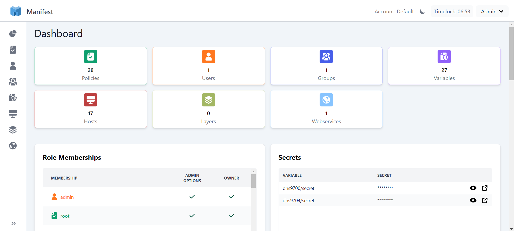

# Welcome at Manifest

Manifest is an open-source platform that provides alternative user interfaces for Conjur services.



## 1. Install Local Manifest with Docker

> [!NOTE]
> Before you begin, ensure you have the following prerequisites:
>
> - [Docker](https://docs.docker.com/get-docker/)
> - [Docker-Compose](https://docs.docker.com/compose/install/)

1. Clone this project repository.
2. Navigate to the repository folder by using the `cd` commands.
3. Go to folder `conjur-tooling`:

   ```bash
   cd conjur-tooling
   ```

4. Start the Docker container by using the below command. You may need to use `sudo` if you don't have permission to run docker-compose:

   ```bash
   docker compose up -d
   ```

   _This command will download the necessary Docker image if it doesn't exist locally and start the container._

5. Create an account named `default`:

   ```bash
   docker exec conjur_server conjurctl account create default > admin-data
   ```

6. Log in as the **admin** user using the `API key for admin` key from the `admin-data` file. Replace `{api-key}` with this key.

   ```bash
   docker exec -it conjur_client conjur init -u https://proxy -a default --self-signed
   docker exec conjur_client conjur login -i admin -p {api-key}
   ```

7. Set your own admin password:

   ```bash
   docker exec conjur_client conjur user change-password -p CONJUR_password1
   ```

8. Rename the `.env.example` file to `.env` and setup your own variables or let the default values.

> [!IMPORTANT]
> If you are running Conjur on a local machine, make sure that NODE_TLS_REJECT_UNAUTHORIZED is set to 0 in your environment

| **Setup for Developers**                                                                                                                                                     | **Setup for Users**                                                                                                                                                          |
| ---------------------------------------------------------------------------------------------------------------------------------------------------------------------------- | ---------------------------------------------------------------------------------------------------------------------------------------------------------------------------- |
| 9. Install project dependencies:                                                                                                                                             | 9. Create a production version of Manifest App with the following command:                                                                                                   |
| `pnpm install`                                                                                                                                                               | `pnpm run build `                                                                                                                                                            |
| 10. Start a development server:                                                                                                                                              | 10. Run Manifest App:                                                                                                                                                        |
| `pnpm run dev`                                                                                                                                                               | `pnpm run preview`                                                                                                                                                           |
| 11. Open the local URL which is provided by the terminal returns and wait for the server to come up. Once the server is up and running, you can access Manifest at this URL. | 11. Open the local URL which is provided by the terminal returns and wait for the server to come up. Once the server is up and running, you can access Manifest at this URL. |
| 12. 🚀 Enhance Your Development Experience with Recommended VS Code Extensions 🚀                                                                                            |                                                                                                                                                                              |

### Enhance Your Development Experience with Recommended VS Code Extensions

To streamline your development workflow and take full advantage of our project's features, we recommend installing the following Visual Studio Code extensions:

1. [Svelte for VS Code](https://marketplace.visualstudio.com/items?itemName=svelte.svelte-vscode)
2. [Tailwind CSS IntelliSense](https://marketplace.visualstudio.com/items?itemName=bradlc.vscode-tailwindcss)
3. [JavaScript and TypeScript Nightly](https://marketplace.visualstudio.com/items?itemName=ms-vscode.vscode-typescript-next)
4. [ESLint](https://marketplace.visualstudio.com/items?itemName=dbaeumer.vscode-eslint)
5. [Prettier ESLint](https://marketplace.visualstudio.com/items?itemName=rvest.vs-code-prettier-eslint)
6. [Prettier - Code formatter](https://marketplace.visualstudio.com/items?itemName=esbenp.prettier-vscode)
7. [Conventional Commits](https://marketplace.visualstudio.com/items?itemName=vivaxy.vscode-conventional-commits)

When you open this project in Visual Studio Code, you may be prompted to install these recommended extensions. We encourage you to accept this recommendation to optimize your coding experience and leverage the full potential of our project.

Happy coding! ✨
